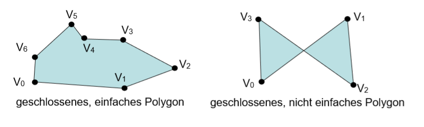
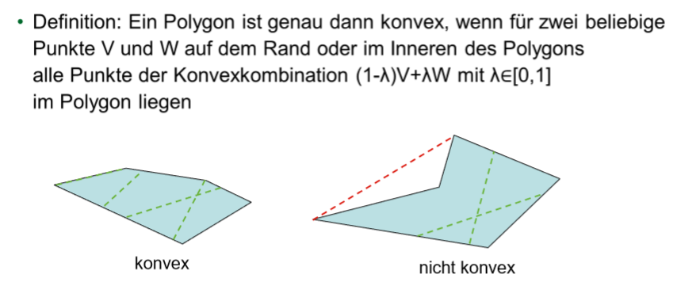

## 0 - Intro

sehr uninteressant, bis auf das Bild von Patrick

## 1 - Einführung

### Was ist dieses Computergrafik, von dem alle reden?

Computergrafik beschäftigt sich mit mathematischen und algorithmischen Ansätzen, die der Erzeugung von Bildern am Rechner dienen. 

Low-level Software-Zugang:

* Moderne Software-Schichten kapseln in Form von APIs, wie z. B. OpenGL oder Direct3D, zunehmend höhere Funktionalitäten
* Zugang eines breiten Kreises von Anwendungsprogrammierern zu Computergrafik-Möglichkeiten

High-level Software-Zugang:

* Moderne Werkzeuge, wie z. B. 3D Studio Max oder Maya ermöglichen den komfortablen Umgang mit Computergrafiktechniken für eine breite Anwenderschicht 


## 2 - OpenGL 


```c++
#include <vector>
#include "GLSLProgram.h"
#include <iostream>
#include <GL/glew.h>
#include <GL/freeglut.h>
#include <GL/glut.h>
#include <glm/glm.hpp>
#include <glm/gtc/matrix_transform.hpp>
#include <glm/gtc/matrix_inverse.hpp>
#include "glm/gtx/rotate_vector.hpp"
#include "GLTools.h"

void render(cg::GLSLProgram & program, glm::mat4x4 view, glm::mat4x4 projection)
{
    // Create mvp.
    glm::mat4x4 mvp = projection * view * object.model;

    // Bind the shader program and set uniform(s).
    program.use();
    program.setUniform("mvp", mvp);

    // Bind vertex array object so we can render
    glBindVertexArray(coordinates.vao);
    glDrawElements(GL_TRIANGLES, indices.size(), GL_UNSIGNED_SHORT, 0);
    glBindVertexArray(0);
}

void initQuad()
{
    // Construct quad. These vectors can go out of scope after we have send all data to the graphics card.
    const std::vector<glm::vec3> vertices = { { -1.0f, 1.0f, 0.0f }, { -1.0, -1.0, 0.0 }, { 1.0f, -1.0f, 0.0f }, { 1.0f, 1.0f, 0.0f } };
    const std::vector<glm::vec3> colors = { { 1.0f, 0.0f, 0.0f }, { 0.0f, 1.0, 1.0f }, { 0.0f, 1.0f, 0.0f }, { 0.0f, 0.0f, 1.0f } };
    const std::vector<GLushort> indices = { 0, 1, 2, 0, 2, 3 };

    GLuint programId = program.getHandle();
    GLuint pos;

    // Step 0: Create vertex array object.
    glGenVertexArrays(1, &quad.vao);
    glBindVertexArray(quad.vao);

    // Step 1: Create vertex buffer object for position attribute and bind it to the associated "shader attribute".
    glGenBuffers(1, &quad.positionBuffer);
    glBindBuffer(GL_ARRAY_BUFFER, quad.positionBuffer);
    glBufferData(GL_ARRAY_BUFFER, vertices.size() * sizeof(glm::vec3), vertices.data(), GL_STATIC_DRAW);

    // Bind it to position.
    pos = glGetAttribLocation(programId, "position");
    glEnableVertexAttribArray(pos);
    glVertexAttribPointer(pos, 3, GL_FLOAT, GL_FALSE, 0, 0);

    // Step 2: Create vertex buffer object for color attribute and bind it to...
    glGenBuffers(1, &quad.colorBuffer);
    glBindBuffer(GL_ARRAY_BUFFER, quad.colorBuffer);
    glBufferData(GL_ARRAY_BUFFER, colors.size() * sizeof(glm::vec3), colors.data(), GL_STATIC_DRAW);

    // Bind it to color.
    pos = glGetAttribLocation(programId, "color");
    glEnableVertexAttribArray(pos);
    glVertexAttribPointer(pos, 3, GL_FLOAT, GL_FALSE, 0, 0);

    // Step 3: Create vertex buffer object for indices. No binding needed here.
    glGenBuffers(1, &quad.indexBuffer);
    glBindBuffer(GL_ELEMENT_ARRAY_BUFFER, quad.indexBuffer);
    glBufferData(GL_ELEMENT_ARRAY_BUFFER, indices.size() * sizeof(GLushort), indices.data(), GL_STATIC_DRAW);

    // Unbind vertex array object (back to default).
    glBindVertexArray(0);

    // Modify model matrix.
    quad.model = glm::translate(glm::mat4(1.0f), glm::vec3(1.25f, 0.0f, 0.0f));
}

void releaseObject()
{
	glDeleteVertexArrays(1, &object.vao);
	glDeleteBuffers(1, &object.indexBuffer);
	glDeleteBuffers(1, &object.colorBuffer);
	glDeleteBuffers(1, &object.positionBuffer);
}

bool init()
{
    // OpenGL: Set "background" color and enable depth testing.
    glClearColor(0.2f, 0.2f, 0.2f, 1.0f);

    // Construct view matrix.
    glm::vec3 eye(0.0f, 0.0f, 4.0f);
    glm::vec3 center(0.0f, 0.0f, 0.0f);
    glm::vec3 up(0.0f, 1.0f, 0.0f);

    view = glm::lookAt(eye, center, up);

    // Create a shader program and set light direction.
    if (!program.compileShaderFromFile("shader/simple.vert", cg::GLSLShader::VERTEX))
    {
        std::cerr << program.log();
        return false;
    }

    if (!program.compileShaderFromFile("shader/simple.frag", cg::GLSLShader::FRAGMENT))
    {
        std::cerr << program.log();
        return false;
    }

    if (!program.link())
    {
        std::cerr << program.log();
        return false;
    }

    // Create objects.
    initQuad();

    return true;
}

void glutKeyboard (unsigned char keycode, int x, int y)
{
	switch (keycode)
	{
	case 27: // ESC
	  glutDestroyWindow ( glutID );
	  return;
	case '+':
		// do something
		break;
	}
	glutPostRedisplay();
}

int main(int argc, char** argv)
{
    // GLUT: Initialize freeglut library (window toolkit).
    glutInitWindowSize(WINDOW_WIDTH, WINDOW_HEIGHT);
    glutInitWindowPosition(40,40);
    glutInit(&argc, argv);

    // GLUT: Create a window and opengl context (version 4.3 core profile).
    glutInitContextVersion(4, 3);
    glutInitContextFlags  (GLUT_FORWARD_COMPATIBLE | GLUT_DEBUG);
    glutInitDisplayMode   (GLUT_RGB | GLUT_DOUBLE | GLUT_DEPTH | GLUT_MULTISAMPLE);

    glutCreateWindow("Aufgabenblatt 01");
    glutID = glutGetWindow();

    // GLEW: Load opengl extensions
    glewExperimental = GL_TRUE;
    GLenum result = glewInit();

    if (result != GLEW_OK) {
        return -1;
    }

    // GLUT: Set callbacks for events.
    glutReshapeFunc(glutResize);
    glutDisplayFunc(glutDisplay);
    //glutIdleFunc   (glutDisplay); // redisplay when idle

    glutKeyboardFunc(glutKeyboard);

    // Init VAO.
    {
        GLCODE(bool result = init());
        if (!result) {
            release();
            return -2;
        }
    }

    // GLUT: Loop until the user closes the window
    // rendering & event handling
    glutMainLoop ();

    // Clean up everything on termination.
    release();

    return 0;
}
```

## 3 - Grundbegriffe

### Farbmodelle


### HSV


Hue / Farbe („Farbfamilie“) 

* „Farbwinkel“ in Grad: 0° ≤ H < 360°

Saturation / Sättigung

* 0 ≤ S ≤ 1; Verkleinerung addiert Weiß 

Value / Helligkeit

* 0 ≤ V ≤ 1; Verkleinerung addiert Schwarz 


### RGB zu HSV

*R*' = *R*/255
*G*' = *G*/255
*B*' = *B*/255
*Cmax* = max(*R*', *G*', *B*')
*Cmin* = min(*R*', *G*', *B*')
Δ = *Cmax* - *Cmin* 

Hue calculation:


Saturation calculation:


Value calculation:
*V* = *Cmax* 


### HSV zu RGB

*C* = *V* × *S*

*X* = *C* × (1 - |(*H* / 60°) mod 2 - 1|)

*m* = *V* - *C*


(*R*,*G*,*B*) = ((*R*'+*m*)×255, (*G*'+*m*)×255,	(*B*'+*m*)×255)

## 4 - Transformationen und Projektionen


#### Translation


#### Rotation in 2D


#### Skalierung

 

#### Scherung


#### Komposition von Transformationen

P' = Mn * ... * M3 * M2 * M1 * P

#### Homogene Koordinaten

Punkt hat eine 1 unten und ein Vektor eine 0.

#### Rotation um die X Achse


#### Rotation um die Y Achse


#### Rotation um die Z Achse


### Transformationen im Code

```c++
// Translation
// wireSphere.model ist das zu bewegende Objekt, position ist der Vector, um den das model bewegt werden soll
object.model = glm::translate(object.model, position);

// Scale
// model wird halbiert | wenn man einen Wert bei einem Vector angibt, sind alle Werte dieser Wert
object.model = glm::scale(glm::vec3(0.5f)) * object.model;

// Rotation
// die Rotations Funktionen benutzen radians und nicht grad
float radians = (angle * (float)PI / 180.0f);
//						zu erstellende Matrix, Winkel, Achse(hier Z-Achse)
object.model = glm::rotate(glm::mat3(1.0f), radians, glm::vec3(0.0f, 0.0f, 1.0f)) * object.model;
```


## 4 - Projektionen


### Parallelprojektionen

* Alle Projektionsstrahlen verlaufen parallel in eine Richtung. 
* Projektionszentrum liegt in einem unendlich fernen Punkt. 


###Perspektivische Projektion

* Bei den perspektivischen Projektionen (Zentralprojektionen) gehen alle Projektionsstrahlen durch das Projektionszentrum, das mit dem Auge des Beobachters zusammenfällt. 
* Perspektivische Projektionen werden nach der Anzahl der Hauptachsen, die von der Projektionsebene geschnitten werden, klassifiziert. So entstehen 1-Punkt-, 2-Punkt- und 3-Punkt-Perspektiven. 

### Zentralprojektionen

+ je zwei parallele Geraden, die nicht parallel zur Projektionsebene sind, treffen sich in einem Punkt, dem Fluchtpunkt. 
+ Es gibt unendlich viele Fluchtpunkte, je einen pro Richtung nicht parallel zur Projektionsebene 
+ Hervorgehoben werden die Fluchtpunkte der Hauptachsen: z.B. Geraden, die parallel zur x-Achse verlaufen, treffen sich in der Projektionsebene im x-Fluchtpunkt. 

* 

  

  ###Kavalier- und Kabinettprojektionen

  * Kavalier- und Kabinettprojektionen gehören zu den schiefwinkligen Parallelprojektionen. Sie entstehen, wenn sich die Projektionsrichtung von der Projektionsebenennormalen unterscheidet.

  ### Axonometrie

  - Bei der Axonometrie ist die Projektionsebene nicht orthogonal zu einer der Koordinatenachsen. 
    - Parallele Linien werden auf parallele Linien abgebildet. 
    - Winkel bleiben nicht erhalten. 
    - Abstände können längs der Hauptachsen gemessen werden, allerdings i.a. in jeweils anderem Maßstab. 
  - Es gibt drei verschiedene Axonometrische Projektionen: 
    - Isometrie 30 30
    - Dimetrie  42 7 
    - Trimetrie 
  - Axonometrien werden oft für Handzeichnungen verwendet 

  ### Zusammenfassung Parrallelprojektionen

  * in 3D-CAD verwendet
  * Längen bleiben erhalten oder werden unabhängig vom Abstand der Objekte zur Bildebene mit einem festen Faktor skaliert.
  * Winkel bleiben erhalten oder werden durch eine festgelegte Art und Weise abgebildet
  * Messungen im projizierten Bild sind möglich, jedoch ohne Tiefeninformationen
  * Darstellung als Projektionsmatrix ist möglich

  * 

## Windowing

  

  

  Legende:

  xw, yw 				Punktkoordinaten im Window

  xs, ys 				Punktkoordinaten auf dem Bildschirm.

  Wxl, Wxr, Wyb, Wyt 	Koordinaten des Windows. 

  Vxl, Vxr, Vyb, Vyt 		Koordinaten des Viewports im BildschirmKoordinatensystem

## Clipping

* Sollen Objekte in der Bildebene innerhalb eines Fensters dargestellt werden, so wird ein Verfahren benötigt, um alle außerhalb des Fensters liegenden Objektteile abzuschneiden. 

### Clipping von Linien

* Beide Endunkte liegen innerhalb des Fensters

  → Linie zeichnen

* Beide Endpunkte der Linie liegen oberhalb, unterhalb, links oder rechts des Fensters:
  → Linie nicht zeichnen

* Sonst: Schnittpunkte der Linie mit dem Fensterrand berechnen und daraus die sichtbare Strecke bestimmen

### Cohen-Sutherland Line-Clipping

Irgendwie ist die Tabelle und das Bild nicht so zusammengehörig.

|       | ...gesetzt falls Region... |        |
| ----- | -------------------------- | ------ |
| Bit 0 | ...links des Fensters      | x<Xmin |
| Bit 1 | ...rechts des Fensters     | x>Xmax |
| Bit 2 | ...unterhalb des Fensters  | y<Ymin |
| Bit 3 | ...oberhalb des Fensters   | y>Ymax |


### Endpunkte einer Line

* Die Linie liegt vollständig außerhald des Fensters, falls der Durchschnitt ( AND-Verknüpfung) der Codes beider Endpunkte von Null verschieden ist
* Die Linie liegt komplett im Fenster, wenn beide Endpunkte den 4-Bit Code 0000 besitzen (OR-Verknüpfung ist Null)
* Sonst
  * Schneide alle Linien nacheinander mit den das Fenster begrenzenden Geraden
  * Zerlege jede Linie in zwei Teile, die gemäß obiger Vorgehensweise kategorisiert werden
  * Der außen liegende Teil wird sofort eliminiert

#### Problem bei Polygon

* Clipping muss wieder geschlossene Polygone zurückgeben, also ggf. Teile des Fensterrandes enthalten

## 5 - Beleuchtungsschattierung

Code zu Shader siehe Kapitel 6 "GLSL"

#### Lokales Beleuchtungsmodell

* nur direkte Beleuchtung
* keine Reflektionen von einem Objekt auf ein anderes

#### Globales Beleuchtungsmodell

* direkte und indirekte Beleuchtung
* Radiosity und Raytracing siehe unten

#### Schattierungsmodell

* bestimmt wann und wo welches Beleuchtungsmodell eingesetzt wird
* zwei Vorgehensmodelle
  * Auswertung eines Beleuchtungsmodells für jedes Pixel
  * Auswertug nur für ausgewählte Pixel; Farben der Zwischenpixel werden per Interpolation bestimmt

Beleuchtung der Szene erfolgt in Weltkoordinaten
Interpolation zwischen Intensitätswerten erfolgt in Bildschirmkoordinaten
--> zwar mathematisch inkorrekt, hat sich aber bewährt...

#### Reflexionen

##### Reflexionsgesetz

Einfallswinkel = Ausfallswinkel

Perfect Specular Reflection

* keine Aufstreuung --> perfekter Spiegel
* existiert in der Realität nicht

Imperfect Specular Reflection

* Lichtstrahl wird bei der Reflexion aufgespalten --> Reflektionskonus
* bei rauer Oberflächer, oder einem unvollkommenden Spiegel

Perfect diffuse Reflection

* bei Reflektion perfekt gestreut
  * gleichmäßige Intensität in alle Richtungen
* bei einer idealen matten Oberfläche
* existiert auch nicht^^

Ambient Light

* aus Einfachheit eine konstante Lichtquelle, die das indirekte Licht simuliert

#### Phong Beleuchtungsmodell

* kein Versuch die Physik zu realisieren
* indirektes Licht wird durch eine ambiente Konstante nur befriedigend dargestellt
* Oberflächen wirken immer wie Plastik; Metall nicht möglich

Phong verbindet drei Reflektionstypen:

* imperfect specular
* perfect diffuse
* ambient light

### Formelzeit - diese Formel ist mit wichtig makiert

Bei jeder Formel muss jeder Vektor normiert sein!!!

$ I = k_dI_d + k_sI_s + k_aI_a$
$ I=I_i(k_d(L*N) + k_s(R*V)^n)+k_aI_a  $

Gewichtung der einzelnen Reflektionstypen:
$ k_d + k_s + k_a = 1 $

n ist eine Konstante, die die Materialbeschaffenheit widerspiegelt(sie simuliert den Perfektionsgrad der Oberfläche)

!! umso höher das $k_s$ umso stärker ist die Spiegelung, umso höher das n umso fokussierter ist die Spiegelung !!
---> da hat Müller gesagt, dass das superwichtig ist

$I_i$ ist die Intensität des einfallenden Lichts
L ist der Vektor, von dem zu berechnenden Punkt zu der Punktlichtquelle
V ist der Vektor vom Punkt zum Augpunkt
N ist die FlächenNormale zu dem Punkt
R ist der Reflexionsvektor $R=2(L*N)N-L$
$I_a$ ist eine konstante

#### Farbe - BlinnPhong

$H=(L+V/||L+V||)$


### Shading

Flat Shading

* einfach und effizientes Verfahren ohne Interpolation
* Kanten der Polygonnetze bleiben erhalten 

### Gouraud Shading

* Verfahren, indem die Kanten der Polygonnetze durch Interpolation geglättet werden
* Die Auswertung erfolgt ausschließlich in den Polygoneckpunkten mithilfe derer Normalen
* Highlights werden etwas verschluckt

### Phong Shading

* Auswertun des Beleuchtungsmodells erfolgt in jedem projizierten Punkt
* interpolierte Normalen
* super mega aufwändig

## 6 - GLSL

```c++
// Datentypen - dann können wir kurz durchatmen beim lernen
bool b;
int i;
float a;
double b;
vec3 x;
vec4 y;
mat3x3 m;
mat4x4 m;
mat2x4 m;

// keine Casts nur Konstruktion
vec3 coord=vec3(0.0); vec4 origin = vec4(coord, 1);

// Selektoren zur Arraydereferenzierung
vec4 hans = vec4(1.0f,2.0f,3.0f,4.0f);
// .rgba(Farben) .xyzw(Vertices) .stpq(wenn man keine Ahnung hat oder so)
// einfacher Zugriff auf Vektoren, da die Menschheit zu faul für eckige Klammern ist
hans.r == hans.x == hans.s == hans[0]

// Kontrollstrukturen sind normal ( C++)

// Phong Shading btw:
// Vertex Shader
in vec3 position;
in vec3 normal;

uniform mat4 mvp;
uniform vec3 farbe;
smooth out vec3 fragmentNormal;
smooth out vec3 fragmentPosition;
flat out vec3 fragmentColor;

void main()
{
    fragmentNormal = normal;
    fragmentColor = farbe;
    fragmentPosition = position;
    gl_Position  = mvp * vec4(position,  1.0);
}

// Fragment Shader
flat in vec3 fragmentColor;
smooth in vec3 fragmentPosition;
smooth in vec3 fragmentNormal;

uniform mat4 mvp; 
uniform mat4 model;
uniform mat3 normaleMatrix;
uniform vec4 light;
uniform vec3 viewpoint;
uniform vec3 material;
uniform int scheinHeiligKeit;

out vec3 fragColor;

void main()
{
    float is = 0;
    vec3 v;
    vec3 richtLichtung;
    vec3 n = normalize(normaleMatrix * fragmentNormal);

    if (light.w == 0) { // Unterscheidung zwischen Punkt und Richtungslicht
        richtLichtung = normalize(light.xyz * -1);
        v = normalize(fragmentPosition - viewpoint);
        
        // Berechnung des Specular Lights
        is = pow(max(0.0f, dot(n, (richtLichtung + v * -1)/length(richtLichtung + v * -1))), scheinHeiligKeit *4);
    } else {
        richtLichtung = normalize(light.xyz - (model * vec4(fragmentPosition,  1.0)).xyz);
        v = normalize((model * vec4(fragmentPosition,  1.0)).xyz - viewpoint);
        
        // Berechnung des Specular Lights
        is = pow(max(0.0f, dot(reflect(richtLichtung, n), v)), scheinHeiligKeit );
    }

    is *= material.y;

    // Hinzufügen eines konstanten ambienten Lichts
    float ia = material.z * 0.1f;
    // Berechnung des diffusen Lichts ; Skalarprodukt aus dem Lichtvektor und der Punktnormalen
    float id = material.x * dot(richtLichtung, n);

    // Beleuchtungsmodell Blinn-Phong; das max stellt lediglich sicher, dass der Farbwert mindestens 0 ist.
    fragColor[0] = max(0.0f, fragmentColor[0] * id + is + ia);
    fragColor[1] = max(0.0f, fragmentColor[1] * id + is + ia);
    fragColor[2] = max(0.0f, fragmentColor[2] * id + is + ia);
}

// Gourouad oder so Shading
// wie phong, aber das was im vert Shader passiert geschieht jetzt im frag Shader und umgekehrt
// Im Vert Shader muss farauf geachtet werden, dass das die fragmentColor smooth ist

// Flat Shading
// wie gyarados shading, allerdings ist die fragmentColor jetzt flat anstatt smooth
```


## 7 - Polygonalenetze

### Einfache und nicht-einfache Polygone

- Liegen alle Kanten eines Polygons in einer Ebene, wird das Polygon planar genannt. 
- Geschlossene einfache Polygone haben immer genauso viele Eckpunkte wie Kanten



### Unterscheidung Topologie / Geometrie

- Topologie
  - Die Menge der Eigenschaften eines Objektes, die durch Starrkörpertransformationen (rigid motions, d.h. Rotation, Translation) nicht verändert werden - die Struktur des Modells
  - Im Beispiel: Das Polygon hat drei Ecken, die jeweils über Kanten in einer festgelegten Reihenfolge miteinander verbunden sind
- Geometrie
  - Die „Instanzierung“ der Topologie durch Spezifikation der räumlichen Lage - die Form des Modells. 
  - Im Beispiel: Die Koordinaten der Eckpunkte


### Eigenschaften von Polygonen

- Typologische Eigenschaften von Polygonen
  - Ein planares Polygon zerlegt die Ebene in mehrere Gebiete, mehrere Innere und ein äußeres, das unbegrenzt ist. 
  - Wichtig dabei ist die Durchlaufrichtung. Eine Kante wird in positiver Durchlaufrichtung durchlaufen, wenn dabei das Innere des Polygon links der Kante liegt. 
  - Der Rand wird also gegen den Uhrzeigersinn durchlaufen
- Konvex oder nicht Konvex das ist hier die Frage
  - 
  - ''Wenn man mit dem Fahrrad die Aussenkanten des Polygons entlangfährt und dabei nur nach links oder nur nach rechts lenken muß, ist das Polygon konvex. Wenn man zwischendurch mal die Lenkrichtung wechseln muß, dann ist es konkav. Dabei ist es egal, ob man im Uhrzeigersinn oder gegen den Uhrzeigersinn die Kanten abfährt.''

## 8 - GLSL Texturen

Texture Mapping:

* Textur + Vertices mit Texturkoordinaten = Texturiertes Polygon

Per Attribut:

* Jeder Vertex hat:
  * Position
  * Normal
  * Texkoord

Texturatlas:

* Alle Polygone eines Objekts in einer Textur

Per Projektion:

* Modellpunkt auf Zylinder/ Kugel/ Ebene

Texturkoordinaten(s,t) -> s ist wie die x-Achse und t dementsprechend die Y-Achse

Texel

* Texture Pixel

Magnification

* Nächster Texel wird vom Pixel abgebildet

Minification

* Viele Texel fallen in ein Pixel

Mipmapping

* Mit jedem Level wird ein 2x2 Texel zu einem einzigen zusammengefasst
  * Dadurch ist die Textur für die Entfernung ungenauer, aber immer noch detailgetreu

## 9 - Decasteljau

$b^j_i = (1-t) * b^{j-1}_i  + t * b^{j-1}_{i+1} $

 $b_i$ sind die jeweiligen Punkte

das j steht dann für die Iterationen

t ist dann die Position  zwischen 0 und 1