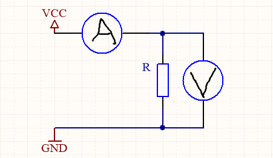

# Praktikum 2 (10 Punkte) – Elektronik

von Tim Steven Meier und Fabian Husemän

## Aufgabe 1

#### a)  

* Stromstärke:
  * die Menge elektrischen Stroms, die in einer bestimmten Zeit durch einen Leiter fließt.
  * die Stromstärke I wird in Ampere gemessen
* Spannung
  * die Stärke des elektrischen Stroms
  * Die Spannung U wird in Volt gemessen

#### b)

$$
R = \frac{U}{I}
$$
$$
R = \frac{12V}{500 \mu A * 10^{-6}}
$$
$$
R = 24000 \Omega
$$

#### c)

$$
U = R * I
$$
$$
P = U * I
$$
$$
P = R * I * I
$$
$$
I^2 = \frac{P}{R}
$$
$$
I = \sqrt{\frac{P}{R}}
$$
$$
I = \sqrt{\frac{0,33W}{1000000 \Omega }} = 0.000574456264654A = 574 \mu A
$$

## Aufgabe 2

#### a)

$$
I = \frac{P}{U}
$$
$$
I = \frac{60W}{12V} = 5A
$$

#### b)

Die Nennspannung der Batterie(18V) ist zu groß für die Betriebsspannung der Lampe(12V), also benötigen wir einen Vorwiderstand
$$
R = \frac{U_L}{I}
$$
$$
\Delta U = U_{ges} - U_L = 18V-12V=6V
$$
$$
I = \frac{P_L}{U_L} = 5A
$$
$$
R = \frac{\Delta U}{\frac{P_L}{U_L}}
$$
$$
R = \frac{6V}{\frac{60W}{12V}} = \frac{6}{5} \Omega
$$

#### c)

$$
t = \frac{Q}{I}
$$
$$
I = \frac{P}{U} = 5A
$$
$$
t = \frac{90Ah}{5A} = 18h
$$

Die Schaltung kann maximal 18h betrieben werden

## Aufgabe 3

#### vor a)

R1 und R2 sind Widerstände

D1 ist eine LED

S1 ist ein Schalter

Q1 ist ein Transistor

Wenn der Schalter S1 geschlossen ist, liegt Strom an der Base des Transistors, welcher dann Strom durchlässt. Dadurch ist der Stromkreis der LED geschlossen und die LED leuchtet. Die Widerstände begrenzen den Stromfluss, damit Bauteile nicht beschädigt werden.

#### a)

LED D1:

Bright Red L-53HD

Spannung:	2V (Betriebsspannung); 1,6V bis 2,5V möglich

Stromstärke:	20mA bei 2 Volt; 0mA(1,6V) bis 50mA(2,4V) möglich

#### b)

Wenn die flache Seite des Transistors oben ist und die Pins zu einem liegen, dann von links nach rechts:

1. Collector
2. Base
3. Emitter

#### c)

$$
U_{diff} = 3,3V - 0,64V - 2V = 0,66V
$$
$$
R_1 = \frac{0,66V}{0,02A} = 33\Omega
$$
$$
R_1 = \frac{3.3V-0.64V}{0,02A} = 133\Omega
$$
