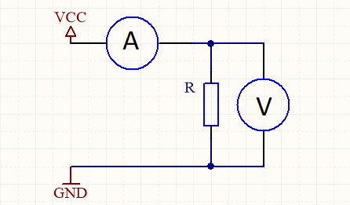

# Praktikum 2 - Elektronik

André Kirsch, Malte Riechmann

##Aufgabe 1

#### Teil a

**Strom**: ([I]=A) Der elektrische Strom gibt an wie viel elektrische Ladung in einer Sekunde durch einen Leiter fließt.

**Spannung**: ([U]=V) Die Spannung entspricht dem Ladungsunterschied (Potential) zwischen zwei Polen und ist Ursache für den elektrischen Strom.

#### Teil b

$$
R = \frac{U}{I}
$$
$$
R = \frac{12V}{500 * 10^{-6} A} = 24k\Omega
$$

#### Teil c

$$
P = U * I, U = R * I
$$
$$
P = R * I * I
$$
$$
I^2 = \frac{P}{R}
$$
$$
I = \sqrt{ \frac{P}{R} }
$$

$$
I = \sqrt { \frac{0.33W}{1 * 10^{6}\Omega}} = 574 \mu A
$$

## Aufgabe  2

#### Teil a

$$
I = \frac{P}{U}
$$
$$
I = \frac{60W}{12V} = 5\Omega
$$

#### Teil b

Die Lampe kann nicht direkt an die Spannungsquelle angeschlossen werden, da die Batterie 18V Nennspannung hat, die Lampe allerdings nur 12V Betriebsspannung hat. Deswegen wird ein Vorwiderstand benötigt.

$$
R = \frac {U}{I}
$$
$$
\Delta U = U_{Ges} - U_L
$$
$$
I = \frac {P_L}{U_L}
$$
$$
R = \frac {\Delta U}{\frac {P_L}{U_L}}
$$
$$
R = \frac {6V}{\frac {60W}{12V}} = \frac {6}{5} \Omega
$$

Der Vorwiderstand

#### Teil c

$$
t = \frac {Q}{I}
$$
$$
I = \frac {P}{U} = 5V
$$
$$
t = \frac {90Ah}{5h} = 18h
$$

**